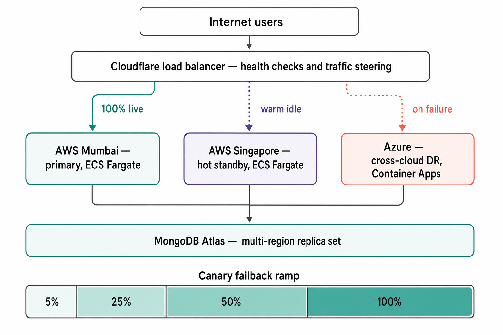
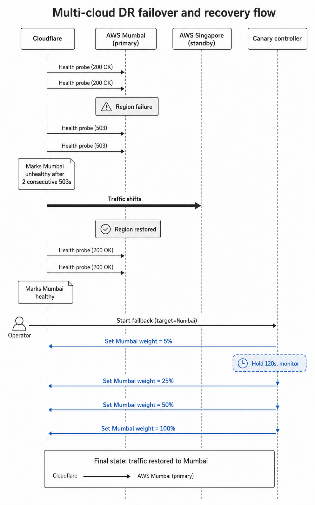
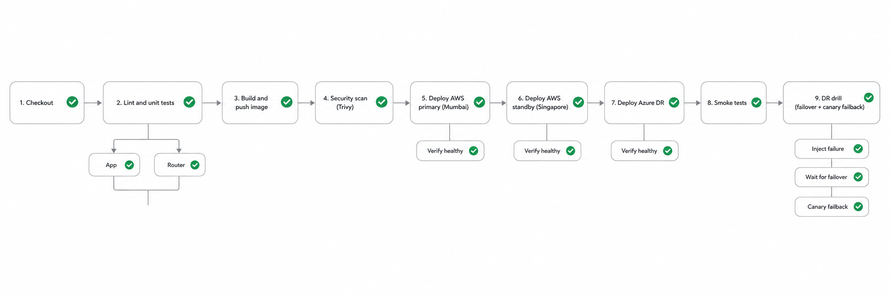

# Multi-cloud DR pipeline

A runnable case study of an active-passive disaster recovery design across
two clouds (AWS + Azure), with Cloudflare-style traffic steering, a custom
canary failback controller, and a Jenkins delivery pipeline that keeps all
three regions in lock-step.

This is the public-facing version of a system I built for an EdTech platform
(TTFA Academy, 2023–2024) that served live classes to ~1000 concurrent
students. The production system used the same topology, threshold logic, and
canary failback algorithm as what you'll find here. The repo is sanitised:
no production secrets, no proprietary domain data, but the engineering is
real.

> **TL;DR.** Cloudflare watches three regional pools. Two are AWS, one is
> Azure. When the primary pool's deep-health probe fails twice in a row,
> traffic moves to the next pool — sub-minute failover with no DNS hop.
> When the primary recovers, a canary controller ramps it back from 5% → 25% →
> 50% → 100% with hold windows between each step, gated on the same health
> probe. If the recovered region degrades during any hold window, the ramp
> rolls back to 0% and traffic stays on the standby. The whole thing runs on
> your laptop in under three minutes — `make up && make drill-failback`.



## Why this exists

Most DR write-ups stop at "draw the topology, add some arrows, mention RTO."
That's the easy part. The hard part is the bit you can't see in a diagram:

- How long does the system wait before deciding a region is unhealthy?
- What does it actually probe? A TCP port? An HTTP endpoint? A query?
- When the failed region comes back, how do you avoid the second outage —
  the one where the recovered region's health endpoint returns 200 but
  some internal subsystem is still warming up?
- Who pulls the trigger on failback? Is it automated? Is that safe?

This repo gets specific about those questions and ships code that
demonstrates the answers.

## What's in here

```
multi-cloud-dr-pipeline/
├── app/                    sample API deployed in each region
├── router/                 mock Cloudflare LB with the canary controller
├── infra/terraform/        IaC for AWS Mumbai, AWS Singapore, Azure, Cloudflare
├── jenkins/                CI/CD pipeline — image build → multi-region deploy → drill
├── scripts/                operational scripts (failure injection, failback, etc.)
├── docs/
│   ├── architecture.md         design and topology
│   ├── design-decisions.md     why the design is the shape it is
│   ├── failover-runbook.md     what the on-call engineer does
│   ├── health-checks.md        the three probes and what each is for
│   ├── rto-rpo.md              targets and how they're hit
│   └── tradeoffs.md            what this design gives up
└── docker-compose.yml      runs the full simulation on a laptop
```

## Quick start

Requirements: Docker, Docker Compose, GNU Make. Nothing else.

```bash
git clone https://github.com/ShubhamPatel2305/multi-cloud-dr-pipeline.git
cd multi-cloud-dr-pipeline

make up                  # builds and starts mongo + 3 regions + the router
sleep 15                 # let the pool settle
make pool                # see all three regions HEALTHY
make seed                # insert a couple of sample courses

make drill-failover      # injects failure on aws-mumbai
make pool                # observe traffic moving to aws-singapore

make drill-failback      # clears the failure and runs the canary ramp
                         # 5% → 25% → 50% → 100% with hold windows

make down
```

What you'll see: the router's pool view will show `aws-mumbai` flipping to
`unhealthy` after two failed probes, the `x-routed-to` header on responses
will switch to `aws-singapore`, and the canary controller will gradually
shift traffic back to Mumbai while monitoring its health.

## Design at a glance

### Active-passive, three priorities

| Priority | Region | Role | Steady-state capacity |
|----------|--------|------|------------------------|
| 1 | AWS Mumbai (`ap-south-1`) | Primary | Full |
| 2 | AWS Singapore (`ap-southeast-1`) | Hot standby | One warm pod, auto-scales on takeover |
| 3 | Azure Central India | Cross-cloud DR | One warm replica, auto-scales on takeover |

Pool ordering is the failover order. There is no geo-steering — every
user goes through the same priority chain. The standby tiers run small
on purpose so the steady-state cost is bounded; takeover triggers
auto-scale to absorb full load.

### Three health endpoints, three consumers

- `/health/live` → container orchestrator. "Is this process alive?"
- `/health/ready` → load balancer. "Should this pod receive traffic?"
- `/health/deep` → Cloudflare LB monitor. "Is this region able to serve real
  requests, with all dependencies?"

Mixing them up is the most common cause of bad failover decisions. Full
breakdown in [`docs/health-checks.md`](docs/health-checks.md).

### Stepped canary failback

The single most important piece of the design. When the failed region
recovers, traffic is **not** flipped back. The canary controller in
[`router/src/canary.py`](router/src/canary.py) ramps it:

```
5%  hold 120s, watch state
25% hold 180s, watch state
50% hold 180s, watch state
100% done
```

If the target's state ever leaves `HEALTHY` during a hold window, weight is
set to 0, the run terminates as `rolled_back`, and traffic continues
flowing to the standby. Hold windows give *real user traffic* time to
expose problems that synthetic probes don't catch.

This is the bit that prevents the second outage — the one that turns a
contained regional incident into a full-blown SEV1.

### Database tier

MongoDB Atlas multi-region replica set. Atlas owns replication and primary
election. Application failover and database failover are independent — the
app tier can flip from Mumbai to Singapore even while the same Mongo
primary keeps serving both. RPO < 5s under majority write concern. Details
in [`docs/rto-rpo.md`](docs/rto-rpo.md).

## Failover sequence



1. Cloudflare's monitor hits `/health/deep` against Mumbai every 30s.
2. Some dependency in Mumbai breaks. The next two probes return 503.
3. Cloudflare marks the Mumbai pool unhealthy and removes it from the
   default pool list. Existing in-flight requests drain through the
   ALB's deregistration delay; new requests hit Singapore.
4. Singapore's ECS service starts auto-scaling from `desired_count=1`
   based on its CPU target tracking policy.
5. Atlas, separately, may or may not have re-elected its primary —
   the application tier is decoupled from this and reconnects on
   `MongoNotPrimaryError`.
6. On-call engineer is paged. They acknowledge, do the RCA on the
   failed region, fix or replace whatever broke.
7. When ready, the engineer runs the canary controller to begin
   failback. The controller drives Cloudflare LB pool weights through
   its API, ramping Mumbai back from 5% to 100% with hold windows.
8. If anything looks bad during the ramp, the controller rolls back
   automatically. The engineer is notified, no human intervention
   needed for the rollback itself.

## CI/CD pipeline



Every commit to `main` triggers the Jenkins pipeline in
[`jenkins/Jenkinsfile`](jenkins/Jenkinsfile):

1. **Lint and unit tests** — app and router run in parallel
2. **Build and push image** — single artifact promoted across all three
   targets, tagged with the commit SHA
3. **Security scan** — Trivy fails the build on `CRITICAL` CVEs
4. **Deploy AWS primary** → verify `/health/deep` returns 200 from
   ≥ 2 targets in the ALB target group
5. **Deploy AWS standby** → verify health
6. **Deploy Azure DR** → verify health
7. **Smoke tests** — direct calls against each region's public hostname
8. **DR drill** — runs against a parallel staging stack: injects a
   regional failure, waits for failover, then runs the canary failback.
   If the canary rolls back, the build fails. This means **every
   release tests its own DR posture**.

The Groovy shared library in `jenkins/shared-library/vars/` factors out
the deploy-and-verify pattern so each target stage is one line.

## What's real, what's simulated

The repo is honest about what it can and can't show.

| Concern | Production (TTFA) | This repo |
|---------|-------------------|-----------|
| Edge LB | Cloudflare load balancer | FastAPI mock router |
| Compute | AWS ECS Fargate, Azure Container Apps | Docker Compose |
| Database | MongoDB Atlas multi-region | Single Mongo container |
| Health probes | Cloudflare HTTPS monitor | Async httpx loop |
| Canary failback | Cloudflare API + controller | **Same controller**, in-memory state |
| Failure injection | iptables rules, region cordon | `/admin/inject-failure` endpoint |

The simulator is faithful where it matters: priority ordering,
threshold-based state transitions, and the failback algorithm are the
same code paths you'd run against a real Cloudflare account, just with
a different transport at the edge. The Terraform under `infra/terraform/`
is the real edge — it's how the production stack is provisioned.

## What I'd do differently today

- **Probe interval.** Cloudflare LB on the plan we used capped probe
  interval at 30s. A custom Lambda-driven probe at 5s would have cut
  MTTD by ~25s.
- **Per-route health.** A region-wide deep probe is too coarse. A
  single broken route can drag the whole region into unhealthy state.
  A `/health/deep?route=courses`-style probe would be more honest.
- **Drills from day one.** The DR drill stage in the Jenkins pipeline
  is something I added late. It should have been part of the pipeline
  from the first deploy. If the failover path isn't exercised on every
  release, you find out it's broken when you need it.
- **Cache warmup on takeover.** First two minutes after takeover, p99
  latency rises sharply because the standby's caches are cold. A slow
  background prefetch of hot keys would help.

More in [`docs/tradeoffs.md`](docs/tradeoffs.md).

## License

MIT. See [`LICENSE`](LICENSE).

## Contact

Built by **Shubham Patel**.
- GitHub: [@ShubhamPatel2305](https://github.com/ShubhamPatel2305)
- LinkedIn: [shubham-patel-0422b0247](https://www.linkedin.com/in/shubham-patel-0422b0247/)
- Email: shubhamcp23@gmail.com

If you're hiring for SDE / backend / platform / SRE-leaning roles and want
to talk about this kind of work, I'd love to hear from you.
